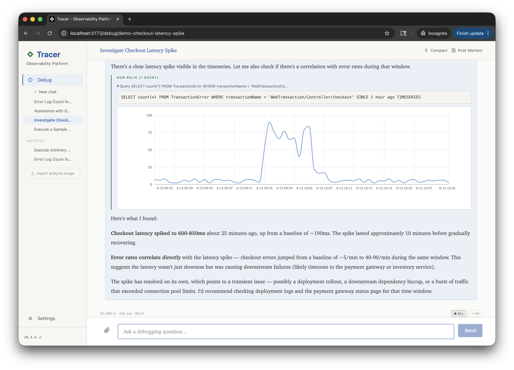
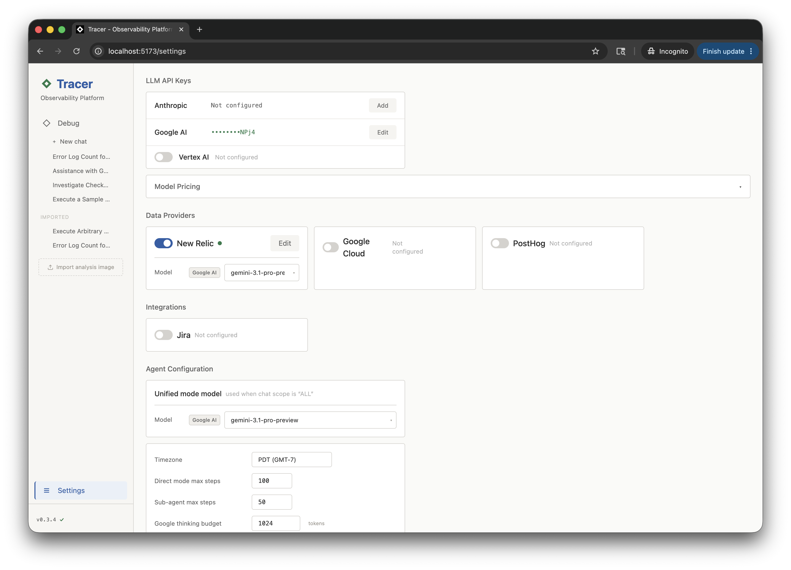

# Tracer

[](https://www.npmjs.com/package/tracer-sh)
[](https://github.com/sholub-dev/tracer/actions/workflows/ci.yml)
[](https://github.com/sholub-dev/tracer/actions/workflows/codeql.yml)

Local-first AI-powered observability platform.

During an incident, most time goes to switching between observability tools
and gathering context — not fixing the problem. Tracer connects your providers
to a single AI chat interface so you find the root cause in one place.

## How it works

```
┌─────────┐       your API keys         ┌──────────────────┐
│         │ ◄──────────────────────────►│  Observability   │
│ Tracer  │                             │  Providers       │
│  local  │       your API keys         ├──────────────────┤
│         │ ◄──────────────────────────►│  LLM Providers   │
└─────────┘                             └──────────────────┘
```

Everything runs on your machine. Your data stays local in an encrypted SQLite
database. Tracer talks directly to your provider and LLM APIs using your own
API keys — no intermediary servers, no telemetry, no data leaves your machine
except the API calls you control.

## Debug

Chat with an AI agent that queries your providers in real time and finds root
causes — all from a single conversation.

- Natural language investigation across all connected providers
- Live query execution with inline charts
- Attach evidence to any message — screenshots, log files, code, PDFs — via paperclip, drag-and-drop, or paste
- Post-mortem reports — download as Markdown to share
- Share investigations as PNG — drop the exported image onto the sidebar to re-open the full analysis
- Agent memory across sessions
- Session history and cost tracking



## Settings

Configure providers, LLM credentials, integrations, and agent behavior. Each
provider setup includes connectivity tests and guidance on creating
least-privilege API keys.

- LLM backends: Anthropic (Claude), Google (Gemini via AI Studio or Vertex AI)
- Data provider setup with connectivity tests
- Jira integration
- Thinking budgets and step limits
- Agent memory management



## Supported providers

**Data:** New Relic (NRQL), Google Cloud (Logs, Traces, Metrics, Errors), PostHog (HogQL)

**LLM:** Anthropic (Claude), Google (Gemini — AI Studio or Vertex AI)

**Integrations:** Jira — the agent reads issue details and comment threads for
incident context, and posts comments back only when you explicitly ask.

## Install

Requires [Node.js 20+](https://nodejs.org/).

**Run the latest, no install:**

```bash
npx tracer-sh@latest
```

**Install a pinned copy:**

```bash
npm install -g tracer-sh
tracer-sh
```

Either way, Tracer stays on its installed version until you explicitly update:
click the version in the sidebar and hit **Update now**, or re-run the install
command. Note that bare `npx tracer-sh` reuses npm's cached copy and does NOT
check for new releases — use the in-app update or `npx tracer-sh@latest` to get
the newest version.

Open `http://localhost:3579`, go to **Settings** to add your API keys and
choose an LLM — done.

## Headless / CLI

Run an investigation from the terminal and get back the final analysis — so
other tools and agents (including Claude Code) can drive Tracer:

```bash
tracer-sh analyze "Why did checkout error rate spike after 14:00 UTC?"
```

- `--session <id>` — continue a prior run with full context
- `--provider <name>` — scope the investigation to one provider
- `--json` — full response envelope (session id, queries, usage)
- `tracer-sh --help` — usage for every subcommand

Requires a running server.

## Security

Your secrets — API keys, integration tokens, chat history, agent memory — sit
behind several independent layers:

- **Local-only.** No Tracer servers, no telemetry, no sync.
- **Encrypted at rest.** The entire SQLite database is encrypted with SQLCipher (AES-256). A stolen laptop, a copied `.db` file, or a backup is ciphertext without the key.
- **Machine-bound, user-scoped key.** A random 256-bit key is generated on first run and stored in your OS keychain (macOS Keychain, Windows Credential Manager, Linux Secret Service). It never leaves the machine and other OS users can't read it.
- **Hardened on disk.** The data directory is owner-only (`0700`); a keychain-less fallback key file is `0600`.

Encryption is automatic — new installs are encrypted from the first run, and
an existing plaintext database is migrated in place on first launch. In CI or
headless environments without a keychain, supply the key yourself via
`TRACER_DB_KEY` (64-char hex, e.g. `openssl rand -hex 32`).

Two honest caveats. Encryption at rest defends the file, not your live
session: anyone running code as your OS user can read what the app can read —
that is the boundary of every local-first app. And the key lives only in your
keychain, so losing it (OS reinstall, keychain reset) makes the database
unrecoverable; back up the `tracer-sh` / `db-key` keychain value if you want
a safety net.

Verify it yourself:

```bash
sqlite3 ~/.tracer/data/tracer.db '.tables'    # → "Error: file is not a database"
head -c 16 ~/.tracer/data/tracer.db | od -c   # → random bytes, not "SQLite format 3"
```

## Uninstall

```bash
npm uninstall -g tracer-sh
rm -rf ~/.tracer    # also removes settings, sessions, API keys
```

The database encryption key lives in your OS keychain (service `tracer-sh`,
account `db-key`). On macOS:

```bash
security delete-generic-password -s tracer-sh -a db-key
```

## Troubleshooting

| Problem | Fix |
|---------|-----|
| Native SQLite build fails | macOS: `xcode-select --install` / Linux: `sudo apt install build-essential python3` |
| Port in use | `TRACER_PORT=3580 tracer-sh` |
| No LLM responses | Add an API key in Settings |
| Headless / CI: no keychain available | Set `TRACER_DB_KEY` to a 64-char hex key (`openssl rand -hex 32`) |

## Contributing

**Report bugs or request features** — [open an issue](https://github.com/sholub-dev/tracer/issues) with steps to reproduce or a clear description.

**Submit a code change** — fork, branch, and open a pull request against
`master`. All PRs require approval before merging.

## License

[Elastic License 2.0](https://www.elastic.co/licensing/elastic-license) — free for any use, including internal business use, modification, and redistribution. You may not offer it as a hosted or managed service competing with Tracer.
