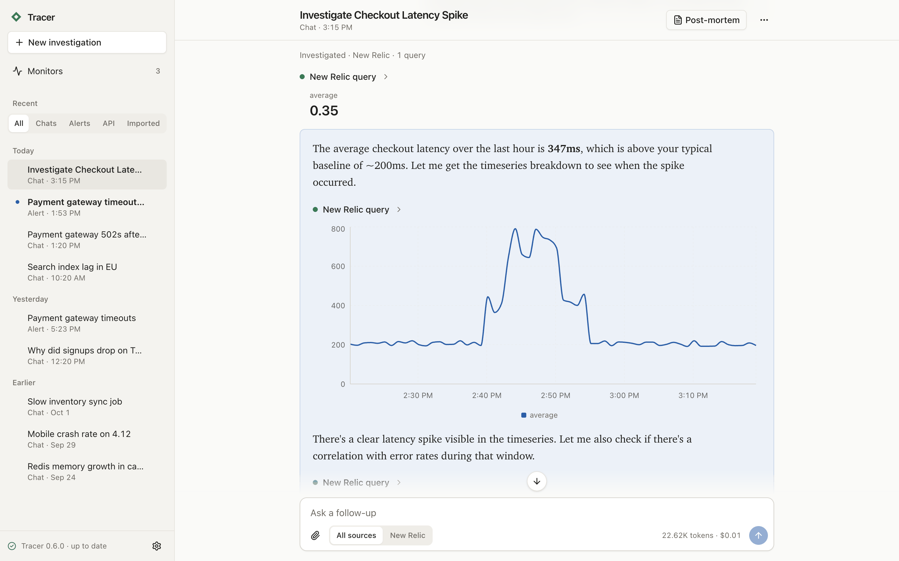
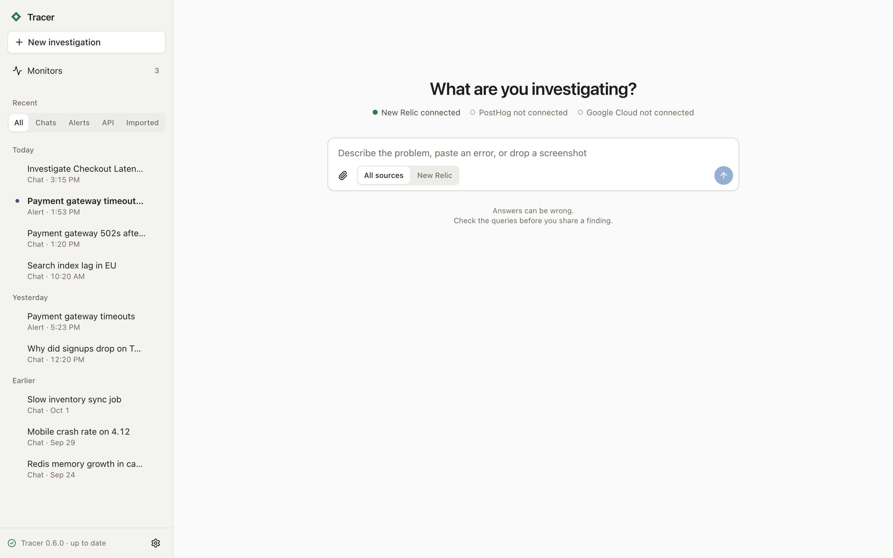
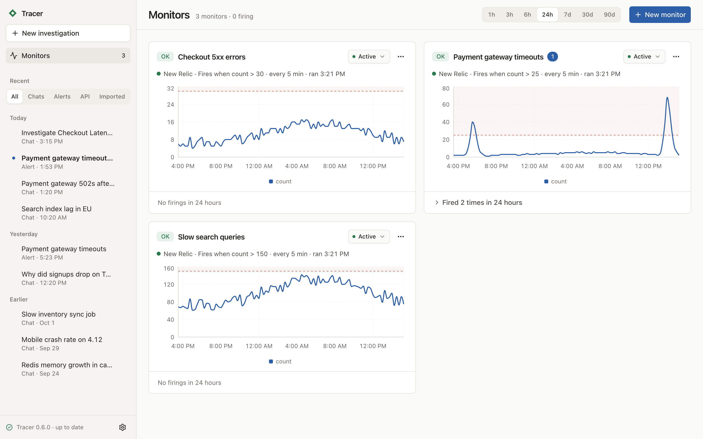
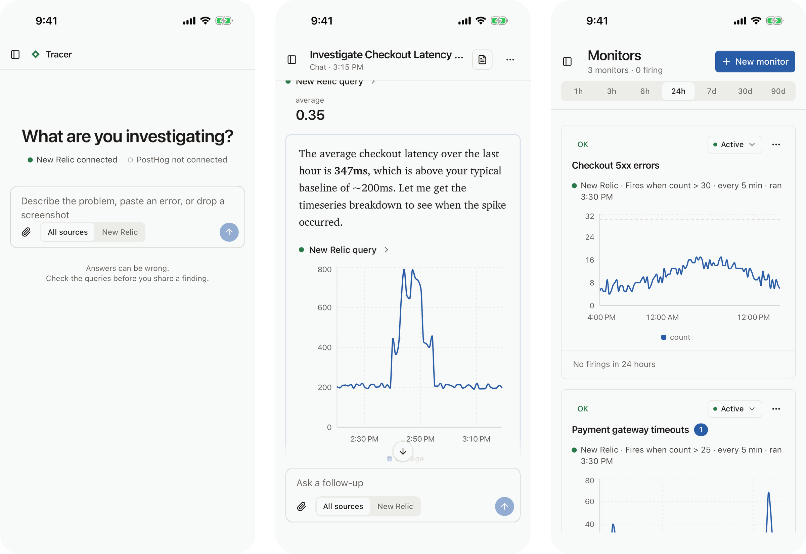

# Tracer

[](https://www.npmjs.com/package/tracer-sh)
[](https://github.com/sholub-dev/tracer/actions/workflows/ci.yml)
[](https://github.com/sholub-dev/tracer/actions/workflows/codeql.yml)

**Ask what broke. Tracer queries your observability tools and finds the root cause.**

Tracer is an AI incident investigator that runs on your machine and on your iPhone.
It uses your own API keys. There is no Tracer server, no account and no telemetry.



## What it does

- **Investigates in chat.** Describe the problem. The agent writes and runs New Relic, PostHog and Google Cloud queries, draws the results, and states the root cause. Every query it used stays one click away.
- **Watches for you.** Tell it what to watch. A monitor checks on a schedule, starts an investigation when it fires, and posts the finding to Slack.
- **Goes with you.** The iPhone app runs the full agent on the phone. One QR scan syncs it with your computer.
- **Takes any evidence.** Paste or drop screenshots, logs, code or PDFs into the chat.
- **Shares results.** Export a post-mortem as Markdown, or an investigation as a PNG. Drop that PNG back into Tracer to reopen the full analysis.
- **Remembers.** The agent keeps notes across sessions. Each session shows its cost.

## Quick start

Requires [Node.js 22.12+](https://nodejs.org/).

```bash
npx tracer-sh@latest
```

1. Open `http://localhost:3579`.
2. In **Settings**, add an LLM key (Anthropic or Google) and connect a data source.
3. Ask a question, for example: *"Why did checkout latency spike after 14:00 UTC?"*

To install a fixed version, run `npm install -g tracer-sh`, then `tracer-sh`.
Tracer updates only when you click the version in the sidebar and select **Update now**.



## Monitors



- **Create in chat.** For example: *"Alert me when checkout errors go above 20 in 5 minutes."* The agent tests the query, then saves it.
- **Investigates on its own.** A firing starts a normal investigation. Its result shows in the sidebar under **Alerts**.
- **Skips repeats.** With `FACET`, a group that was investigated in the last 24 hours is marked as a repeat and linked to that session.
- **Posts to Slack.** Add an incoming webhook in **Settings > Integrations**. Tracer posts the severity, the root cause with its confidence label and what it did to the New Relic issue, and tags the people you set.
- **Never misses a window.** Checks run on round clock times over back-to-back windows, so no event counts twice.

## iPhone app



The app runs the whole of Tracer on the phone: the agent, the monitors and the encrypted database.
Calls go straight from the phone to your providers and your LLM.

**Install** (Xcode and a free Apple ID are enough):

```bash
pnpm install
pnpm --filter @tracer-sh/ios build
pnpm --filter @tracer-sh/ios open
```

In Xcode, select your team under **Signing & Capabilities**, select your iPhone, and click **Run**.
A free Apple ID signs the app for 7 days. Requires iOS 15 or later.

**Limits on the phone:**
- Monitors check only while the app is open. The screen stays on while an investigation runs.
- Google Cloud, Vertex AI, the CLI and PNG import are desktop only.

### Sync with your computer

1. On the computer, open **Settings > Phone**. A QR code shows.
2. Scan it with the iPhone Camera, then confirm on the phone.
3. On the computer, select **Allow**.

The first sync copies everything from the computer, including keys, monitors and sessions.
Later syncs with the same computer merge both ways: the newest version of each item wins, and deletions carry over.
A sync with a different computer replaces the phone's data.
Monitors that are new to a device arrive paused, so the same alert never posts twice.

The data moves only on your Wi-Fi, encrypted with AES-256-GCM.
The key travels only inside the QR code. Each code works once and expires after 2 minutes.

## CLI

Run an investigation from a script or a coding agent. The server must be running.

```bash
tracer-sh analyze "Why did checkout error rate spike after 14:00 UTC?"
```

| Option | Effect |
|---|---|
| `--session <id>` | Continue an earlier investigation with its full context |
| `--provider <name>` | Use one provider only (`newrelic`, `gcp`, `posthog`) |
| `--json` | Print the full result: session id, queries and token usage |

To let Claude Code or Cursor use Tracer, install the Tracer skill from **Settings > Integrations**.

## Providers

| | |
|---|---|
| **Data** | New Relic (NRQL), PostHog (HogQL), Google Cloud (Logs, Traces, Metrics, Errors) |
| **LLM** | Anthropic (Claude), Google (Gemini through AI Studio or Vertex AI) |
| **Jira** | The agent reads issues and comments. It posts a comment only when you ask. |
| **Slack** | Monitor findings go to one channel through an incoming webhook. |

Each data source setup tests the connection and explains how to create a read-only key.

## Security

- **Local only.** Tracer talks only to your providers and your LLM, with your keys.
- **Encrypted at rest.** SQLCipher (AES-256) encrypts the whole database. A copied `.db` file is unreadable without the key.
- **Key in the OS keychain.** Tracer creates a random 256-bit key on first run and stores it in the macOS Keychain, Windows Credential Manager or Linux Secret Service. On iPhone, the key is in the iOS Keychain.
- **Owner-only files.** The data folder is `0700`. A fallback key file is `0600`.
- **Loopback only.** The desktop server listens on `127.0.0.1` and rejects requests for any other host name.

Encryption protects the file, not a running session. Code that runs as your OS user can read what Tracer reads.
If you lose the keychain entry (`tracer-sh` / `db-key`), you lose the database. Back up that entry if you need a safety net.
Without a keychain (CI, headless Linux), set `TRACER_DB_KEY` to 64 hex characters (`openssl rand -hex 32`).

Check it yourself:

```bash
sqlite3 ~/.tracer/data/tracer.db '.tables'    # Error: file is not a database
```

## Troubleshooting

| Problem | Fix |
|---|---|
| Native SQLite build fails | macOS: `xcode-select --install`. Linux: `sudo apt install build-essential python3` |
| Port in use | `TRACER_PORT=3580 tracer-sh` |
| No LLM responses | Add an API key in **Settings** |
| Phone does not find the computer | Put both on the same Wi-Fi. Allow **Local Network** for Tracer in iOS Settings |

## Uninstall

```bash
npm uninstall -g tracer-sh
rm -rf ~/.tracer                                       # settings, sessions and keys
security delete-generic-password -s tracer-sh -a db-key   # macOS keychain entry
```

## Contributing

[Open an issue](https://github.com/sholub-dev/tracer/issues) for bugs and ideas.
For code, fork the repo and open a pull request against `master`.

## License

[Elastic License 2.0](https://www.elastic.co/licensing/elastic-license). You can use, change and share Tracer, also inside your company.
You cannot offer it as a hosted or managed service.
